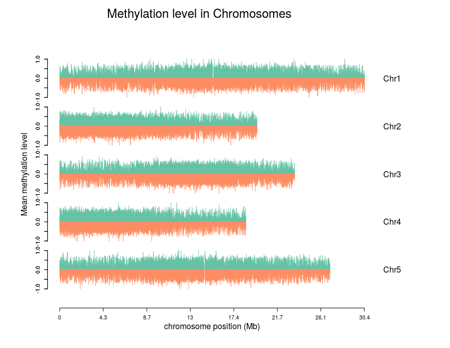

# R-script

these scripts are based on bioconductor project

## 1.update R
    install.packages("installr")
    require(installr)
    updateR()
## 2.methylation level in genome-wide
    plot_reads_methylation.R

## 3. tissue specific genes identification
    TissueEnrich
